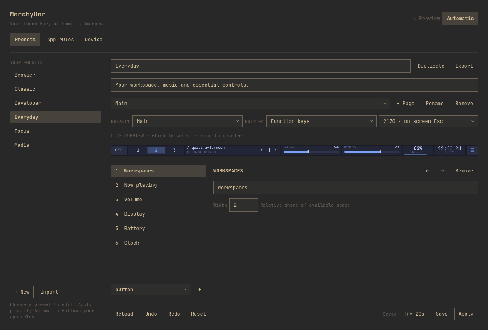

# MarchyBar

Your Touch Bar, at home in Omarchy.

MarchyBar is a native Omarchy shell plugin for Intel T2 MacBook Pro computers, with experimental Apple Silicon support. It combines an editable Touch Bar with live controls, automatic app layouts, and an Omarchy-themed preset editor.

**Compatibility target:** latest stable Omarchy (4.0.4), with the T2 Linux kernel (`linux-t2`) and `appletbdrm`. Omarchy 4.0.4 migrates other machines to `linux-omarchy` but keeps T2 Macs on `linux-t2`; MarchyBar refuses hardware enablement with a recovery hint when a supported model boots any other kernel. Targets MacBookPro15,1–15,4 and MacBookPro16,1–16,4. Both 2170×60 and 2008×60 logical panels are supported; the renderer discovers actual DRM geometry and input ranges. See [validation](docs/VALIDATION.md) for the distinction between tested behavior and physical model coverage.

**Experimental Apple Silicon:** the 13-inch M1 MacBook Pro (2020, `MacBookPro17,1`) and 13-inch M2 MacBook Pro (2022, `Mac14,7`) running a compatible Omarchy installation with Asahi drivers. Neither model has been physically tested with MarchyBar. This does not install Omarchy or port it to ARM64, and does not support macOS. Read the [research and testing guide](docs/APPLE-SILICON.md) before enabling hardware.



## What you get

- Six editable presets: Everyday, Focus, Media, Developer, Browser, and Classic.
- Live media transport and seeking, workspaces, battery, clock, CPU, memory, and focused-app information.
- Continuous volume, display brightness, keyboard brightness, and Touch Bar brightness sliders.
- Ordered application rules with wildcard matching and optional window-title filters.
- Preset creation, duplication, renaming, deletion, factory restoration, and JSON import/export.
- Pages, a held-Fn page, adjustable widget widths, drag reordering, keyboard-accessible move buttons, undo/redo, and stale-edit protection.
- A preview rendered by the physical device renderer, plus a 20-second trial with automatic rollback.
- Current Omarchy theme colors, font, control styling, and corners.
- Temporary device access and suspend coordination. T2 restores its original firmware mode while locked/disabled; Apple Silicon leaves the bar dark.

## Install

Start with a working T2 Linux installation of Omarchy. MarchyBar does not replace your kernel or install Apple firmware.

Apple Silicon testers should follow the [separate setup and rollback instructions](docs/APPLE-SILICON.md#test-setup), not the T2 kernel instructions below.

Install dependencies from Arch repositories:

```sh
omarchy pkg add nodejs npm base-devel pkgconf cairo libdrm pango librsvg python-gobject acl brightnessctl playerctl wtype libpulse
```

Node 22 or newer is required; an existing compatible Node installation also works. Omarchy supplies Quickshell, Hyprland, systemd, and the native shell controls.

Install MarchyBar:

```sh
omarchy plugin add https://github.com/Githubguy132010/MarchyBar --enable
```

The current release is **v1.0.0**. See [releases](https://github.com/Githubguy132010/MarchyBar/releases) for changes.

Click **▰** in the Omarchy bar. The first launch builds a small native renderer in your user cache; subsequent launches reuse it. Install the trusted system package described below, then open **Device → Set up Touch Bar**, authenticate the device configuration, and enable the bar. An existing `tiny-dfr` or `touchbard` process must be stopped before enabling MarchyBar.

### Install the protected system helper

The plugin cannot bootstrap privileged code from its user-writable checkout. An administrator must first install a matching, independently trusted `marchybar-system` package. No published signed binary package is provided yet. For a local build, obtain and review a separate source snapshot, review `packaging/PKGBUILD` and its inputs, then build as an ordinary user:

```sh
cd packaging
makepkg
```

Have the administrator install the reviewed package with `pacman -U /path/to/marchybar-system-1.0.0-1-any.pkg.tar.zst`. Do not use the live plugin checkout as a trusted source or run its installer with sudo/pkexec. Local checksums bind the reviewed inputs; they do not authenticate an untrusted download or protect a compromised build session.

The package installs root-owned files under `/usr/lib/marchybar-system/` and a dedicated policy at `/usr/share/polkit-1/actions/org.marchybar.system.policy`. Package installation does not start the service. Setup accepts only `setup` or `remove`, checks the helper's canonical path, ownership, mode and SHA-256 before calling `/usr/bin/pkexec`, and requires fresh administrator authentication for an active session. The protected helper verifies its fixed payload hashes and never reads code from the plugin checkout. Python runs in isolated mode and the privileged shell receives a fixed environment.

The plugin's standard Omarchy installation never executes a privileged hook. The separate setup deploys exactly:

- `/usr/local/lib/marchybar/device-broker.py`
- `/etc/systemd/system/marchybar-device.service`
- `/etc/udev/rules.d/90-marchybar.rules`

The renderer and all user actions run as your desktop user. The helper authenticates the active local session and leases the identified Touch Bar display, touch input, and built-in keyboard for Fn/wake detection. It does not grant membership in `input` or `video`, execute commands from presets, or unload `t2bce`.

## Use

Select a preset to edit it. Changes stay in a draft until **Save**. **Apply** pins the saved preset; **Automatic** resumes app matching. Rules are evaluated from top to bottom, then the default preset is used. Editing the layout preserves the last app context so opening the editor doesn't change the layout under your cursor.

Device brightness is shown as 0–100%; 0% turns the light off. Numeric settings are saved on Enter or when leaving the field, and live updates do not overwrite an edit.

Choose a page and click a widget in the preview or list. Drag across the preview to reorder, or use the arrow buttons. Width is a relative share of the space remaining after minimum touch-target widths. A page that cannot fit either supported geometry is rejected before saving. Put additional controls on another page.

**Try 20s** temporarily applies a draft and rolls back automatically. It never saves the draft. **Revert** ends the trial immediately. Closing with unsaved changes asks whether to discard them. **Reload** recovers from a stale-edit warning; **Reset** restores a bundled preset or deletes a custom one.

A button can send a key chord, control media, select a workspace/page/preset, launch a desktop app, or run an argument array. Commands execute directly without a shell. To intentionally use a shell, explicitly choose an argument array such as `["bash", "-lc", "your command"]`. Imported actions only run when activated; review actions from other people before using them.

For commands that open applications, select **Run independently** (`"detached": true`). MarchyBar starts the process without capturing output or waiting for it to exit; only process-start errors are reported. Other commands retain a 30-second timeout. The bundled Terminal button runs independently.

The Developer preset's Find and Save buttons send `Ctrl+F` and `Ctrl+S` to the focused application. These are editor shortcuts, not terminal search or save commands. At a Bash prompt, `Ctrl+F` moves forward one character and `Ctrl+S` may pause output; `Ctrl+Q` resumes it. Their behavior inside a terminal application depends on that application's bindings.

A right click on the bar icon resumes Automatic mode. The Touch Bar's rightmost menu button opens the editor. Esc remains at the left on models without a physical Escape key.

## Command line

The installed entry point is `~/.config/omarchy/plugins/marchybar.touchbar/bin/marchybar`. You may symlink **this executable** into `~/.local/bin`; don't put symlinks inside the plugin directory.

```sh
marchybar open
marchybar list
marchybar apply media
marchybar auto
marchybar disable
marchybar enable
marchybar export everyday ~/everyday.json
marchybar import ~/everyday.json
marchybar diagnostics
marchybar update
marchybar update --with-omarchy
```

## Files and updates

User presets and settings live separately from plugin updates:

```text
~/.config/marchybar/presets/*.json
~/.config/marchybar/settings.json
~/.config/marchybar/rules.json
~/.local/state/marchybar/last-good.json
~/.cache/marchybar/native/<platform-architecture-source-hash>/
$XDG_RUNTIME_DIR/marchybar/control.sock
```

Bundled presets are immutable package files; editing one creates a user override. Restoring removes that override. Preset files are written atomically. Invalid files remain on disk and are reported rather than silently overwritten. Changes made externally take effect when the backend restarts.

Use **Device → Update MarchyBar** or `marchybar update` for repository updates. **Update with Omarchy** or `marchybar update --with-omarchy` updates and reloads MarchyBar, then runs the standard Omarchy system updater. This order finishes the plugin update before Omarchy can offer a reboot. Both use Omarchy's existing update commands and confirmations. The editor launches an independent terminal so shell restarts do not interrupt the workflow. Save any drafts before updating. The editor closes when you start; wait for updates to finish before editing again.

When the plugin revision changes, MarchyBar restarts the shell to load the new code. An enabled Touch Bar returns after the session unlocks; an intentionally disabled bar stays disabled. If the shell cannot restart, the updater reports the pending restart and the command to run after unlocking. A failed plugin update or restart stops the combined workflow. Omarchy may restart the shell again or offer a reboot. Updates run directly through `omarchy plugin update` still need a shell restart to replace MarchyBar's retained service.

If a release changes the device helper, have the administrator install the matching reviewed system package, then run **Set up Touch Bar** again. Mismatched helper hashes fail closed. Updates never install privileged helper files automatically. The source, preset, and control protocol versions are explicit.

## Disable or uninstall

Disabling the Touch Bar closes the renderer. On T2 it restores the previous USB mode and brightness; on Apple Silicon it leaves the bar dark and does not restart `tiny-dfr`. To remove the helper and plugin while preserving presets:

```sh
marchybar disable
marchybar uninstall-system
omarchy plugin remove marchybar.touchbar --yes
```

After `uninstall-system` succeeds, the administrator may remove `marchybar-system` with the package manager. Keep the package installed until device cleanup succeeds.

User presets are deliberately retained. Remove `~/.config/marchybar` separately only if you want to erase them.

Apple Silicon testers must also follow the [tiny-dfr handoff](docs/APPLE-SILICON.md#return-to-tiny-dfr) after removing the helper.

## Development

```sh
npm ci --ignore-scripts
npm run build
npm test
python tests/broker_test.py
python tests/system_action_test.py
tests/test-qml.sh
```

Run a separate, hardware-free preview backend:

```sh
bin/marchybar preview --socket /tmp/marchybar-dev/control.sock \
  --config /tmp/marchybar-dev/config --state /tmp/marchybar-dev/state
MARCHYBAR_SOCKET=/tmp/marchybar-dev/control.sock bin/marchybar status
```

The normal daemon deliberately refuses simulation. Preview mode never leases devices or executes OS actions. Do not run the renderer as root. Omarchy rejects symlinks inside plugin packages, so `node_modules` and build output are excluded from Git and installed builds use an external cache.

Read [architecture and protocol](docs/ARCHITECTURE.md), [validation](docs/VALIDATION.md), and the [research brief](research/MarchyBar-Research-Brief.md).

## Contributing and support

Bug reports and contributions are welcome through [GitHub issues](https://github.com/Githubguy132010/MarchyBar/issues) and pull requests. Include your Mac model, Omarchy and kernel versions, reproduction steps, and relevant diagnostics. Review diagnostics before sharing them. See [CONTRIBUTING.md](CONTRIBUTING.md) for the development checks.

## License

GPL-3.0-or-later. The native rendering/input core is derived from `react-drm-for-touchbar`; see [THIRD_PARTY.md](THIRD_PARTY.md) for provenance and the pinned source revision. MarchyBar does not depend on its React application or settings UI.
