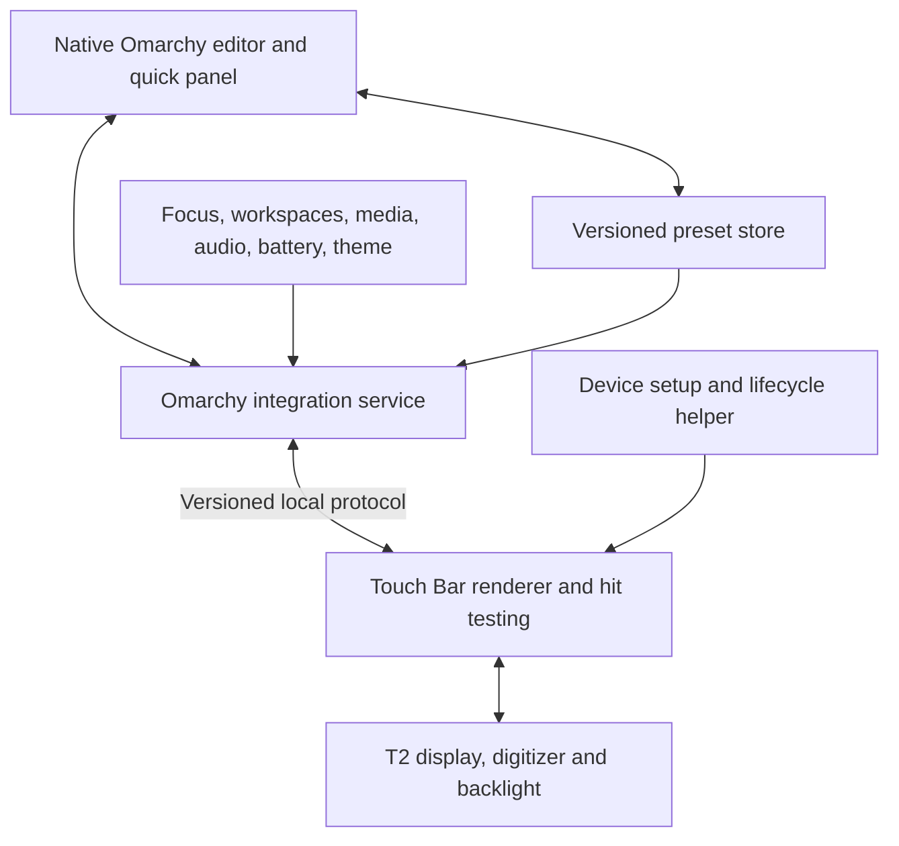

# MarchyBar

## Omarchy and Touch Bar research brief

**Research date:** 5 September 2026  
**Audience:** MarchyBar product and implementation work  
**Target:** All Intel T2 MacBook Pro models on current stable Omarchy  
**First release:** Native preset creation and editing, rich live widgets, continuous sliders, and automatic app layouts

## 1. Recommended direction

Build MarchyBar as a **native Omarchy Quickshell plugin with a separate Touch Bar rendering backend**. The desktop editor, quick preset selector, app rules, and theme integration should use Omarchy’s actual components. Hardware rendering should have its own process and a small, versioned interface.

For the first hardware prototype, evaluate the pinned **react-drm-for-touchbar rendering core**. It already implements continuous touch interactions and a socket bridge for editing widgets. Extend it with MarchyBar’s declarative presets and theme roles; do not adopt its entire control-center application or installer. A focused Rust derivative of tiny-dfr is the alternative if the React/native dependency chain, measured resource use, lifecycle behavior, or GPL distribution requirements make that foundation unsuitable. This is an engineering recommendation, not a claim that either backend has passed MarchyBar hardware tests. [Implemented slider](https://github.com/dev-muhammad-adel/react-drm-for-touchbar/blob/c7203f4ce574455b0e6a1a6e515e702d3d05c5d8/linux-touchbar-control-center/app/audio-slider/page.tsx), [editor protocol](https://github.com/dev-muhammad-adel/react-drm-for-touchbar/blob/c7203f4ce574455b0e6a1a6e515e702d3d05c5d8/src/custom-layer/types.ts).

Stock tiny-dfr alone cannot deliver the requested first release. Its configuration supports two layers and configurable keys, images, clock, and battery, but not general slider widgets or automatic app-to-preset rules. A settings wrapper would leave essential features missing. [Pinned tiny-dfr configuration](https://github.com/AsahiLinux/tiny-dfr/blob/eb711c87fcbddda67be3fd5ff45385b139e8fb34/share/tiny-dfr/config.toml).

Research is complete enough to choose the product architecture and define the prototype. Backend performance, real device recovery, and cross-model reliability remain experimental questions. No software was installed, hardware mode changed, or Omarchy configuration edited during this research.

## 2. What Omarchy is now

Omarchy is an opinionated Linux distribution built around Arch, Hyprland, and, in version 4, Quickshell. Its experience combines keyboard navigation, terminal-oriented workflows, coordinated themes, and a curated set of applications and commands. Native integration means participating in these conventions rather than reproducing one theme’s colors in an independent settings app. [Official introduction](https://omarchy.org/manual/), [navigation](https://omarchy.org/manual/navigation/).

**Current stable is 4.0.2, released 31 August 2026**, at commit `346e69e1cec6c4e8924531874af6ba010a1bc99e`. Quattro, version 4.0.0, shipped on 14 August. It replaced the earlier collection of bar, launcher, notification, OSD, lock, idle, wallpaper, and authentication programs with a shared plugin shell. Older Waybar/Walker/Mako tutorials describe a different architecture. The current canonical repository is `omacom/omarchy`; many indexed links still use `basecamp/omarchy`. [4.0.2 release](https://github.com/omacom/omarchy/releases/tag/v4.0.2), [4.0.0 release](https://github.com/omacom/omarchy/releases/tag/v4.0.0).

### System responsibilities relevant to MarchyBar

| Layer | Responsibility | MarchyBar implication |
|---|---|---|
| Arch packages and systemd | Runtime dependencies, kernel modules, services | Package hardware support separately from the QML checkout |
| Hyprland | Windows, workspaces, focus, input bindings | Observe focus and workspace changes; use current Lua-compatible dispatch |
| Quickshell / `omarchy-shell` | Shared desktop UI and services | Host the editor and integration service here |
| Omarchy commands | Consistent user-facing system actions | Reuse supported audio, display, launch, and menu behavior |
| User configuration | Plugins, layout, hooks, overrides | Keep editable presets outside package-owned files |
| Generated state | Active theme, runtime state, migration markers | Separate generated previews and last-applied state from source presets |

The source tree separates contributor instructions (`agents/skills`), architecture reference (`docs`), and the published user manual (`manual`). Runtime files are packaged under `/usr/share/omarchy`; commands are on PATH. Defaults seed users through `omarchy-settings`, while user overrides survive independently. MarchyBar should be a separate project, not an edit to packaged Omarchy files. [Stable file-layout reference](https://github.com/omacom/omarchy/blob/346e69e1cec6c4e8924531874af6ba010a1bc99e/docs/file-layout.md).

Omarchy’s update command coordinates packages, per-user migrations, hooks, and restarts. MarchyBar therefore needs reconnection and state restoration after shell restarts, and its own versioned preset migrations. A plugin Git update and a backend package update are separate events. [Stable update process](https://github.com/omacom/omarchy/blob/346e69e1cec6c4e8924531874af6ba010a1bc99e/docs/update-process.md).

### This machine is a useful development target, not the entire support matrix

Read-only inspection found:

| Item | Observed value |
|---|---|
| Model | `MacBookPro15,1` |
| Omarchy / settings packages | `4.0.2-1` |
| Quickshell | `0.3.1-1` |
| Hyprland | `0.56.2-1` |
| Kernel package | `linux-t2 7.1.8.arch1-3` |
| Running kernel | `7.1.8-arch1-Watanare-T2-3-t2` |
| Touch Bar mode | Firmware keyboard mode; USB configuration 1 |
| Renderer | tiny-dfr is not installed |
| Available module | `appletbdrm` supplied by the running kernel |
| Local source checkout | `d3d23fdd…`, dated 2 September; newer than stable |

The local package database lists tiny-dfr `v0.3.7.r8.g3f666f9-1` in `arch-mact2`. This database was not refreshed, so that is a local packaging observation, not an independently verified current mirror selection. The installed system and the newer source checkout were kept distinct throughout the review.

## 3. How native Omarchy plugins work

A third-party plugin is a Git repository with a root `manifest.json`, installed beneath `~/.config/omarchy/plugins/<id>/`. The reserved `omarchy.*` namespace belongs to built-ins. Setup → Plugins and `omarchy plugin` manage discovery, enablement, updates, cloning, and removal. Plugins execute inside the user’s shell process; installation does not provide a privileged hardware dependency hook. [Plugin manual](https://omarchy.org/manual/shell-plugins/), [stable installer source](https://github.com/omacom/omarchy/blob/346e69e1cec6c4e8924531874af6ba010a1bc99e/bin/omarchy-plugin-add).

The manifest contract has `schemaVersion: 1`, an ID, name, version, kinds, and entry points. Supported kinds are `bar-widget`, `panel`, `overlay`, `menu`, `service`, and `bar`. One plugin can combine kinds. A full `bar` replaces the desktop bar; that is not what MarchyBar needs. [Stable plugin registry](https://github.com/omacom/omarchy/blob/346e69e1cec6c4e8924531874af6ba010a1bc99e/shell/services/PluginRegistry.qml).

**Proposed MarchyBar structure:** a `bar-widget` for current status and quick switching, a `panel` for the editor, and a `service` for shared state and context routing. Use a permanent owner-qualified ID such as `io.github.<owner>.marchybar` once the publishing owner is chosen. A tentative source layout is:

```text
manifest.json
BarWidget.qml
Editor.qml
Service.qml
components/
models/
presets/                 bundled examples only
backend/                 protocol adapter or pinned core integration
packaging/               backend package and device setup
tests/
README.md
LICENSE
```

Entry-point objects participate in the host’s injected properties and lifecycle. Summoned surfaces implement open/close; widgets receive their bar context and settings. The host can also provide a shared service to a plugin panel. MarchyBar should reconnect after hot reload rather than assume service objects live forever. In particular, newer checkout changes to service `keepLoaded` handling are not automatically part of stable 4.0.2. [Stable shell host](https://github.com/omacom/omarchy/blob/346e69e1cec6c4e8924531874af6ba010a1bc99e/shell/shell.qml).

The shell uses `shell.json` for layout and enabled plugin entries, with settings inline on those entries. Preset documents should have their own storage and schema instead of crowding this shared file. CLI-to-shell communication uses the native IPC route; command exit success alone should not be mistaken for a successful requested mutation without examining the returned status. [Shell reference](https://github.com/omacom/omarchy/blob/346e69e1cec6c4e8924531874af6ba010a1bc99e/docs/omarchy-shell.md).

A menu entry can be added through the user’s `extensions/omarchy-menu.jsonc` overlay. Preserve existing entries and use a namespaced new key. The menu is a keyed tree with actions and existing providers; a plugin cannot declare a new provider merely by adding JSON. Prefer an ordinary action that opens MarchyBar. [Stable menu implementation](https://github.com/omacom/omarchy/blob/346e69e1cec6c4e8924531874af6ba010a1bc99e/shell/plugins/menu/Menu.qml).

Before distribution, validate the manifest/folder and lint QML against the installed imports. Then exercise actual open/close, keyboard navigation, disable/re-enable, reload, and removal. Marketplace submission adds discovery, not a runtime compatibility guarantee. No long-term QML API stability promise was found in the reviewed sources. [Development guide](https://plugins.omarchy.org/develop.html), [publishing guide](https://plugins.omarchy.org/publish.html).

## 4. The Omarchy design language

Omarchy’s design language is a live system of theme roles, spacing, typography, borders, and interaction states. It is not synonymous with dark backgrounds, rounded cards, or a specific accent color.

The stable shell exposes reusable controls including `Button`, `Dropdown`, `SearchableDropdown`, `TextField`, `NumberField`, `ToggleSwitch`, `PanelSlider`, `ConfirmDialog`, `KeyboardPanel`, and `PanelKeyCatcher`. Use these directly. [Stable UI module exports](https://github.com/omacom/omarchy/blob/346e69e1cec6c4e8924531874af6ba010a1bc99e/shell/Ui/qmldir).

`Color` supplies palette and surface roles; `Style` supplies type and spacing scales, the configured font, and corner geometry. The default is square corners, but user customization must remain respected. Border-aware components preserve theme gradients and border widths. Keyboard focus, pointer hover, selection, and pressing have distinct shared states. [Style source](https://github.com/omacom/omarchy/blob/346e69e1cec6c4e8924531874af6ba010a1bc99e/shell/Commons/Style.qml), [shell theme template](https://github.com/omacom/omarchy/blob/346e69e1cec6c4e8924531874af6ba010a1bc99e/default/themed/shell.toml.tpl).

Themes are staged and generated from palettes/templates, then activated and propagated to running applications. User overrides and hooks are supported. Bind QML to the shell’s theme objects; send resolved semantic tokens to the external renderer when they change. Do not require restarting a backend for every color change. [Theme architecture](https://github.com/omacom/omarchy/blob/346e69e1cec6c4e8924531874af6ba010a1bc99e/docs/theming.md).

### Proposed visual behavior

- A compact quick panel shows the active preset, whether it is automatic or pinned, and a clear “Edit presets” action.
- The editor has a preset list, a proportional Touch Bar preview, and an inspector for the selected widget. Use progressive disclosure for app rules and advanced actions.
- Selection, insertion, reordering, and width changes work with keyboard controls as well as dragging. Sliders also have a readable value field.
- Follow light and dark themes, font changes, scaling, all bar positions, and multi-monitor placement. Avoid permanent macOS-style chrome copied from a backend demo.
- Theme the physical bar through explicit renderer roles: background, foreground, muted, accent, selected, urgent, and focus. Give touch targets a dedicated physical size policy instead of applying desktop scaling blindly.
- Show unavailable data plainly. A missing media player should produce an empty media state, not a frozen title that appears live.

These are MarchyBar design recommendations, not existing product screens.

## 5. T2 hardware scope and driver model

Apple identifies T2 MacBook Pros as the Intel models introduced from 2018 through 2020, excluding the M1 model. T2-equipped MacBook Airs and desktops do not become Touch Bar targets simply because they have T2. [Apple T2 scope](https://support.apple.com/en-gb/103265).

| Intended family | Model identifiers |
|---|---|
| 13-inch, 2018 / 2019, four ports | `MacBookPro15,2` |
| 15-inch, 2018 | `MacBookPro15,1` |
| 15-inch, 2019 | `MacBookPro15,1`, `MacBookPro15,3` |
| 13-inch, 2019, two ports | `MacBookPro15,4` |
| 16-inch, 2019 family | `MacBookPro16,1`, `MacBookPro16,4` |
| 13-inch, 2020, four ports | `MacBookPro16,2` |
| 13-inch, 2020, two ports | `MacBookPro16,3` |

Identifiers are from [Apple’s model reference](https://support.apple.com/en-gb/108052). This is the intended qualification matrix, not a list of MarchyBar-tested devices. Omarchy’s Mac manual has apparent model-table errors, so it was not used as the authoritative identifier list.

Omarchy already installs T2 support components and defaults to firmware Touch Bar function/media keys. Custom drawing uses a separate path: the kernel’s `appletbdrm` driver, Touch Bar input/backlight devices, and a userspace renderer. Current t2linux documentation places the upstream Touch Bar drivers at Linux 6.15; internal connectivity still depends on the T2 stack. [Omarchy Mac support](https://omarchy.org/manual/mac-support/), [t2linux feature state](https://wiki.t2linux.org/state/).

The DRM driver matches Apple USB device `05ac:8302` and obtains display dimensions from the device. Discover it by identity and capabilities, not by a hardcoded `/dev/dri/cardN`, USB bus path, or desktop screen number. Model variants also differ in Escape handling; tiny-dfr reserves a software Escape region based on reported width. [Linux driver](https://github.com/torvalds/linux/blob/v6.15/drivers/gpu/drm/tiny/appletbdrm.c), [tiny-dfr geometry/configuration](https://github.com/AsahiLinux/tiny-dfr/blob/eb711c87fcbddda67be3fd5ff45385b139e8fb34/src/config.rs).

The reviewed udev setup changes the device from firmware configuration 1 through 0 into graphics configuration 2, and isolates its display/input seat. Restoring firmware mode requires releasing the renderer and reversing that transition. No transition was performed here; a successful reversal on every target model remains a release test. [tiny-dfr udev rules](https://github.com/AsahiLinux/tiny-dfr/blob/eb711c87fcbddda67be3fd5ff45385b139e8fb34/etc/udev/rules.d/99-touchbar-tiny-dfr.rules).

Current `t2bce` differs from legacy `apple-bce`. The present guidance says not to unload `t2bce` before suspend because the driver manages its own lifecycle. Older recipes involving forced unloads and fixed USB resets are not universal recovery instructions. Remaining sleep issues can be model-dependent. MarchyBar should diagnose the installed generation and preserve the OS’s existing sleep behavior. [Current post-install and suspend guidance](https://wiki.t2linux.org/guides/postinstall/).

## 6. Renderer and existing-project comparison

The following are source inspections, not hardware benchmarks or endorsements.

| Foundation | Useful existing work | Missing or problematic for MarchyBar | Assessment |
|---|---|---|---|
| Stock tiny-dfr | Rust DRM/input plumbing; simple layer configuration; brightness and key generation | General sliders, app rules, rich scenes, full palette IPC | Hardware reference and smaller-backend alternative |
| `niraj-envision/touch-bar` | Omarchy focus integration, live SVG widgets, raw touch handling, plugin entry | Separate GTK editor; incomplete preset CRUD; fixed geometry; installer and removal changes | Learn from specific ideas; avoid wholesale adoption |
| `mac-touchbar-plus` | Rust app/media integrations and extra layers | Fixed layer categories, compiled special behavior, substantial restructuring for generic widgets | Weaker fit than the other candidates |
| `react-drm-for-touchbar` | Continuous touch events, slider implementation, widget rendering and editing bridge | MarchyBar presets, complete theme API, lifecycle/permission adaptation | First prototype candidate for rich v1 |
| New backend from scratch | Full control | Rebuilds much of the input, rendering, and recovery machinery | Reserve for a demonstrated need |

### Stock tiny-dfr: useful lessons

The inspected revision is `eb711c87…`, with Cargo version 0.3.7. It uses vendor defaults plus `/etc/tiny-dfr/config.toml`. Configuration is watched, but malformed overrides can fall back to defaults; file replacement and reload acknowledgement need explicit validation. Its process opens devices and then drops privileges. [Loader](https://github.com/AsahiLinux/tiny-dfr/blob/eb711c87fcbddda67be3fd5ff45385b139e8fb34/src/config.rs), [runtime](https://github.com/AsahiLinux/tiny-dfr/blob/eb711c87fcbddda67be3fd5ff45385b139e8fb34/src/main.rs).

Its backlight implementation dims after 30 seconds and turns off after 60, with lid/activity behavior; those timings are implementation constants. Native editor theming does not automatically theme this renderer. Code is MIT, with separate icon licensing to preserve when reusing assets. [Backlight source](https://github.com/AsahiLinux/tiny-dfr/blob/eb711c87fcbddda67be3fd5ff45385b139e8fb34/src/backlight.rs), [project README and licenses](https://github.com/AsahiLinux/tiny-dfr/blob/eb711c87fcbddda67be3fd5ff45385b139e8fb34/README.md).

### Existing Omarchy Touch Bar project

At revision `e4840378…` from 4 September, the native bar widget fronts a separate GTK4/libadwaita editor. The settings code edits existing app profiles and their buttons, but the review did not find a full create/duplicate/rename/delete preset-library flow. [Manifest](https://github.com/niraj-envision/touch-bar/blob/e484037829bf3c6d41932d735522da18e71d0837/manifest.json), [settings implementation](https://github.com/niraj-envision/touch-bar/blob/e484037829bf3c6d41932d735522da18e71d0837/src/omarchy-touchbar-settings).

The daemon assumes a 2170×60 bar and normalized input range, combines generated images with raw input processing, and gates reloads around held touches. Its gate has a timeout, so the code does not establish an absolute guarantee against mid-press changes. The fixed geometry is particularly relevant to our all-model target. [Daemon source](https://github.com/niraj-envision/touch-bar/blob/e484037829bf3c6d41932d735522da18e71d0837/src/omarchy-touchbar).

The installer makes tiny-dfr configuration user-writable and installs additional integration; removal explicitly leaves privileged pieces for separate cleanup. This reinforces the need for a defined install/update/restore contract. Its code is MIT, so selected reuse is possible with attribution. [Installer](https://github.com/niraj-envision/touch-bar/blob/e484037829bf3c6d41932d735522da18e71d0837/install.sh), [uninstaller](https://github.com/niraj-envision/touch-bar/blob/e484037829bf3c6d41932d735522da18e71d0837/uninstall.sh), [license](https://github.com/niraj-envision/touch-bar/blob/e484037829bf3c6d41932d735522da18e71d0837/LICENSE).

### Extended renderers

`mac-touchbar-plus` revision `072ee6b0…` uses fixed Fn/Media/Custom2/Custom3 categories and application-specific behavior. It does not expose the general widget/preset model MarchyBar needs. Its system-service and helper structure would also need review before reuse. [Configuration source](https://github.com/dev-muhammad-adel/mac-touchbar-plus/blob/072ee6b0d46a8ab525a52e8ad8760c044a2970ea/src/config.rs), [service](https://github.com/dev-muhammad-adel/mac-touchbar-plus/blob/072ee6b0d46a8ab525a52e8ad8760c044a2970ea/etc/systemd/system/tiny-dfr.service).

`react-drm-for-touchbar` revision `c7203f4c…` has a real widget-editing bridge, but it currently represents one custom layer rather than a complete named-preset library. Its general theme object contains only a font family, and component colors need integration. Production runs compiled JavaScript; editing its executable configuration is not the runtime preset workflow we want. [Configuration blueprint](https://github.com/dev-muhammad-adel/react-drm-for-touchbar/blob/c7203f4ce574455b0e6a1a6e515e702d3d05c5d8/linux-touchbar-control-center/config.blueprint.ts), [configuration loader](https://github.com/dev-muhammad-adel/react-drm-for-touchbar/blob/c7203f4ce574455b0e6a1a6e515e702d3d05c5d8/linux-touchbar-control-center/lib/utils/configLoader.ts).

Its user-service lifecycle is helpful, but the suspend code references old apple-bce teardown assumptions and its device rules grant broader group access than a narrowly scoped device broker would. A lock-aware policy was not established by this review. These are adaptation requirements, not proof of a current exploit. The project uses GPL-3.0; preserve and satisfy the applicable license for any incorporated code rather than treating it as MIT. [User service](https://github.com/dev-muhammad-adel/react-drm-for-touchbar/blob/c7203f4ce574455b0e6a1a6e515e702d3d05c5d8/system/react-drm.service), [suspend implementation](https://github.com/dev-muhammad-adel/react-drm-for-touchbar/blob/c7203f4ce574455b0e6a1a6e515e702d3d05c5d8/linux-touchbar-control-center/lib/services/suspend.ts), [device rules](https://github.com/dev-muhammad-adel/react-drm-for-touchbar/blob/c7203f4ce574455b0e6a1a6e515e702d3d05c5d8/system/99-react-drm-t2linux.rules), [repository license](https://github.com/dev-muhammad-adel/react-drm-for-touchbar/tree/c7203f4ce574455b0e6a1a6e515e702d3d05c5d8).

A bounded exact-name search and current marketplace registry inspection found no MarchyBar entry. That is a discovery result, not comprehensive name clearance.

## 7. Proposed MarchyBar architecture

The remainder of this brief is a proposed product and engineering design unless a source is explicitly attached.



### Native integration service

Own preset selection, automatic rules, current theme tokens, and session actions in a QML service. Quickshell exposes active toplevel/workspace state and events for Hyprland; use these instead of running `hyprctl` continuously. Expect null focus and respect the compositor’s Lua-mode dispatch differences. [Quickshell Hyprland API](https://quickshell.org/docs/v0.3.0/types/Quickshell.Hyprland/Hyprland/).

Reuse Omarchy’s media and audio behavior. In particular, volume controls resolve through DSP sinks to the real output, and display brightness has Apple-specific resolution. A generic “first backlight” or direct default-sink write can behave differently from Omarchy’s own controls. Continuous sliders will need an adapter supporting absolute target values, throttling, and final-value confirmation rather than spawning one command for every raw touch sample. [Audio command](https://github.com/omacom/omarchy/blob/346e69e1cec6c4e8924531874af6ba010a1bc99e/bin/omarchy-audio-output-volume), [display brightness command](https://github.com/omacom/omarchy/blob/346e69e1cec6c4e8924531874af6ba010a1bc99e/bin/omarchy-brightness-display).

### Renderer contract

Give the renderer declarative scenes and typed widget values, not executable preset scripts. The protocol should negotiate versions and capabilities, report geometry, accept complete scene revisions and incremental value changes, emit actions, and acknowledge what was actually applied. Reconnect after shell reload without losing device control or executing stale actions.

The renderer should own drawing and hit testing from the same geometry. Pointer capture must keep a slider attached to the original gesture even if focus or a preset changes. Either defer scene changes until release or cancel the old gesture explicitly. Include scene revision IDs with action events so the session can reject stale input.

Keep runtime data in memory and communicate through a local socket. Avoid regenerating `/etc` files for every media update or slider movement. A framebuffer preview or shared renderer scene should drive the editor preview so it accurately represents the physical bar.

### Device ownership and session boundary

Only one renderer may own the Touch Bar. Device setup must identify the actual hardware, detect competing daemons, and preserve a recoverable firmware mode. The desktop shell should never run with elevated privileges.

Prefer a narrow device helper or carefully scoped device access over unrestricted access to every keyboard/input node. The exact descriptor/seat mechanism needs a hardware prototype; it is not a solved implementation in this brief. Whatever the mechanism, application launches and commands remain in the active user session. Losing the session connection must disable custom actions and sensitive content while preserving an agreed basic fallback.

Do not couple essential hardware cleanup to the destruction of a QML object. Shell crashes, plugin removal, and logout need an independently observable lifecycle. Native plugin disablement should stop MarchyBar’s session behavior; a separate explicit restore/uninstall operation should clean up installed system components.

## 8. Presets, editing, and automatic layouts

### Data model

Separate three concepts:

| Concept | Contains |
|---|---|
| Preset | Name, stable ID, layers/pages, widgets, actions, optional local styling |
| App rule | Match conditions, priority, target preset, enabled state |
| Device preferences | Brightness, idle behavior, default preset, Escape/Fn policy |

Use versioned data documents, preferably JSON for direct QML tooling and schema validation. Every widget and preset has a stable ID independent of its display name. Actions should be typed, for example media action, workspace selection, application launch, keyboard shortcut, or user command. Commands are an advanced user-session feature, not something evaluated by a privileged renderer.

Suggested storage:

```text
~/.config/marchybar/settings.json
~/.config/marchybar/rules.json
~/.config/marchybar/presets/<id>.json
~/.config/marchybar/assets/
~/.local/state/marchybar/last-good.json
~/.cache/marchybar/previews/
$XDG_RUNTIME_DIR/marchybar/
```

These are proposed MarchyBar paths, not existing Omarchy conventions or installed files.

Bundled presets should be editable in the normal user flow. Internally, editing one creates a full user-owned override keyed to the bundled ID, retaining origin/version metadata. Updates never overwrite that override. Offer “Restore bundled version” and “Save as new preset.” Avoid silently merging new upstream widget layouts into a customized preset.

### Complete editor behavior

The first release includes create-from-empty, create-from-template, edit, duplicate, rename, reorder, delete, import, and export. Support undo/redo, validation beside the affected field, unsaved-change handling, and explicit distinction between saved and currently applied state. Deleting a preset referenced by app rules must offer reassignment rather than leave dangling rules.

Users can add, remove, reorder, and resize widgets; configure tap/hold behavior where supported; and edit normal/Fn layers. Provide keyboard move-left/right actions alongside drag-and-drop. Validate minimum usable widths and protect required Escape behavior for models without a physical key.

The preview can simulate focus, media state, and both device geometries without owning hardware. Physical “Try” mode should have a visible revert action and a last-known-good rollback. An error must identify whether saving failed, the renderer rejected a scene, or hardware is unavailable.

### Initial preset collection

| Preset | Proposed contents |
|---|---|
| Everyday | App-aware center, workspaces, volume and display controls, clock/battery |
| Focus | Minimal current-workspace/app context, clock, mute, compact brightness |
| Media | Artwork/title when available, playback, seek when supported, continuous volume |
| Developer | Workspace tools, terminal/editor shortcuts, optional CPU/RAM widgets |
| Browser | Back/forward, tab navigation, reload, zoom, media controls |
| Classic | Familiar function/media layers and an easy recovery starting point |

Each is a starting point, not a locked layout. Rich live widgets, continuous sliders, and automatic layouts remain first-release requirements; these presets do not defer them.

### Rule behavior

Use an ordered, explainable rule list. Recommended precedence: locked/unavailable safety state; explicit user pin; temporary Fn/page state; highest-priority matching app rule; default preset. Display why the active preset was chosen.

Match desktop application identity first. Offer bounded title matching as an advanced option. Generic window focus does not reveal browser tabs, a terminal’s active program, or an editor’s document model reliably. Those richer integrations need dedicated adapters; do not promise them merely because app switching works. The first release can provide automatic layouts for browser, terminal, editor, and media applications without claiming arbitrary internal application introspection.

Hold the previous application context while MarchyBar’s editor is focused. Do not change slider meaning midway through a drag. Pinning a preset should be obvious, reversible, and preserved according to an explicit session preference.

## 9. Installation, updates, recovery, and removal

The intended installation experience has two clear steps: native plugin installation, then an integrated hardware setup screen if the backend is missing. That screen detects supported hardware, checks the existing Touch Bar owner and module generation, and describes the concrete required setup. It should not force users to understand USB configuration numbers or edit TOML by hand.

Package the backend and required device files reproducibly. Keep privileged executables package-owned, separate from a user-editable plugin checkout. Do not assume a manifest can install dependencies. Pin the tested rendering foundation and track backend/plugin protocol compatibility.

The setup flow should record the prior renderer, service state, and configuration it changes. Import supported existing tiny-dfr settings where meaningful and report unsupported fields. Preserve originals. Restoration must distinguish firmware mode from an earlier custom renderer; “restore” should not simply delete configuration and hope a daemon recovers.

The runtime needs explicit states: unsupported hardware, setup required, starting, ready, sleeping, recovering, and error. During suspend, follow the installed kernel’s lifecycle; after resume, re-enumerate devices and reconcile state before accepting touches. Avoid hardcoded bus paths and unconditional module resets.

At lock, clear sensitive app/track/title content according to a defined privacy policy, stop custom launch/command actions, and retain only deliberately permitted basic controls. Omarchy already allows several standard media/brightness bindings while locked, so MarchyBar’s behavior should be consistent but explicit. [Stable media bindings](https://github.com/omacom/omarchy/blob/346e69e1cec6c4e8924531874af6ba010a1bc99e/default/hypr/bindings/media.lua).

An integrated “Restore and uninstall” flow should stop the backend, restore the previous functioning mode, remove only owned integration, and then remove the native plugin. Preserve user presets unless the user chooses deletion. Ordinary `omarchy plugin remove` is not a general system-package uninstaller, so document that distinction and make leftover backend behavior safe.

## 10. Verification required before release

### First hardware prototype: backend decision gate

Prove these on the available Mac before committing the product to a renderer:

1. Discover devices, enter graphics mode, render a themed scene, and restore firmware mode.
2. Drag real volume and display sliders continuously, including external value changes.
3. Switch app presets while interacting without wrong actions or stuck modifiers.
4. Restart the shell, restart the backend, unplug/re-enumerate where practical, and recover without manual edits.
5. Lock/unlock, lid-close, suspend/resume on modern t2bce, and test unavailable devices at initial startup.
6. Measure idle CPU, memory, redraw rate, drag latency, and wake behavior. Establish acceptance budgets from measurements rather than inventing performance claims.

If the pinned React core passes with a maintainable adaptation, proceed with it. If removing its fixed assumptions and dependency/lifecycle machinery outweighs its interaction reuse, use the Rust hardware foundation behind the same MarchyBar protocol. This gate selects implementation, not feature scope.

### Product and compatibility tests

| Area | Required evidence |
|---|---|
| Presets | CRUD, import/export round trips, migrations, malformed data, duplicate IDs, interrupted writes, rollback |
| Rules | Ordered matches, null focus, pin/unpin, editor focus, app exit, gesture-time changes |
| UI | Real stable Omarchy imports; keyboard-only editing; light/dark themes; larger fonts; all bar positions |
| Rendering/input | Both Escape geometries; actual device dimensions; edge targets; simultaneous touches; stuck-key recovery |
| Services | No media player; changing audio sinks; DSP output; missing sensors; display versus Touch Bar brightness |
| Lifecycle | Login/logout; plugin disable/remove; shell reload; backend failure; lock; repeated and extended sleep |
| Installation | Existing firmware/tiny-dfr/alternative owner; idempotent setup; version mismatch; restore/uninstall |
| Model coverage | Results recorded for each intended identifier, kernel/backend version, and tested operations |

Use the Omarchy validator and QML linting, pure model tests, backend protocol tests, and isolated UI acceptance work. The upstream test layout distinguishes CLI/shell checks from graphical tests; manifest validation alone cannot verify interaction or hardware behavior. [Stable test-suite entry point](https://github.com/omacom/omarchy/blob/346e69e1cec6c4e8924531874af6ba010a1bc99e/test/all).

## 11. Confidence, limitations, and research coverage

**High confidence:** stable Omarchy 4 has the needed native plugin surfaces; current T2 custom rendering uses existing drivers; stock tiny-dfr cannot alone meet the rich-widget brief; editable user presets must be separate from shipped defaults; the available machine is in firmware mode with the DRM module available.

**Moderate confidence:** a pinned React-to-DRM core is the best first prototype for rich v1. Source demonstrates relevant interactions, but this research did not execute its code, audit every dependency, benchmark it, or certify it across T2 models.

**Not yet established:** stable behavior after every suspend/driver failure; measured power use; exact privilege-broker implementation; complete integration with user-customized app shortcuts; all-model hardware qualification; final publishing identity and license structure.

The investigation covered official releases/manuals, the stable source and newer local checkout, plugin loading and distribution, theme/control APIs, command/menu integration, package/update ownership, T2 model scope and driver changes, installed hardware state, four existing renderer approaches, and preset/lifecycle requirements. It does not claim literal knowledge of every Omarchy subsystem or every third-party plugin.

Research stopped when the consequential architectural claims had primary evidence, version conflicts were reconciled, and the remaining uncertainties required implementation or hardware experiments rather than more broad searching. The next concrete work is a small hardware/backend prototype plus the native editor’s interaction design, with the full rich first-release scope preserved.
